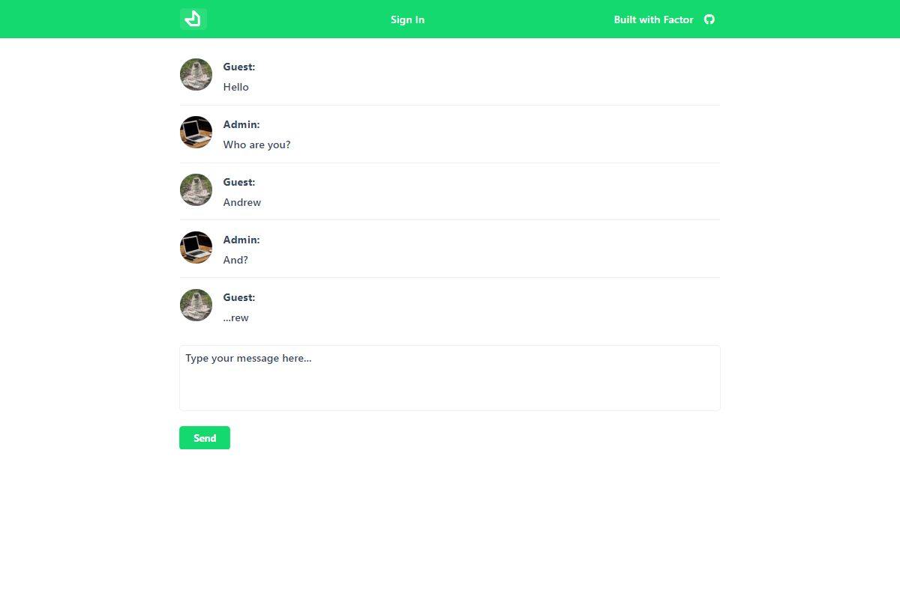

<h1 align="center">Factor Chat Example</h1>

<p align="center">
Chat example built with Factor. Includes middleware for a websocket as well as using Form UI.
</p>

<p align="center">
  <a href="https://chat-example.factor.dev" target="_blank">
    
  </a>
</p>

<p align="center">
<a href="https://chat-example.factor.dev" target="_blank"><strong>Live Demo &rarr;</strong></a>
</p>


## About

This is a simplified chat example. Allows guests to communicate with admin.

## Features

- Embedded posts
- Websockets with authentication
- Guest and admin roles

## Admin mode

You can login as admin and check all chats with following credentials:
* login: `chat-admin@factor.dev`
* password: `69ndik8WUG9ubFA`

## Docs and Architecture Overview

**Factor docs can be found [here](https://factor.dev).**

## Build Setup

**Requires Node.js LTS+**

```bash
# install dependencies
npm install # or yarn

# serve in dev mode, with hot reload at localhost:3000
npm run dev

# build for production
npm run build

# serve in production mode
npm start
```

## License

MIT
